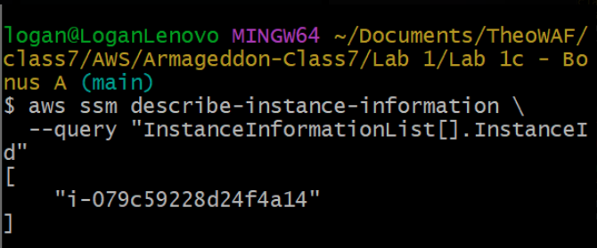
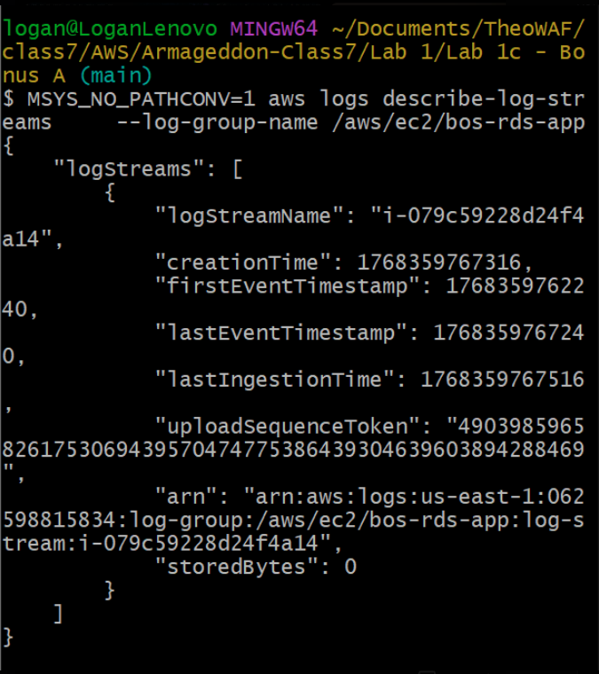

# Armageddon lab 1  |  Class 7: Zion  |  AGroup: Brotherhood Of Steel

---

<sup>lab 1 diagram</sup>

## Architecture Justification

This architecture deploys a single Amazon EC2 instance in a public subnet within a VPC, providing direct internet access through an attached Internet Gateway. The EC2 instance uses an IAM instance profile to securely access AWS services without embedding credentials in the application. Application configuration and secrets are retrieved from AWS Systems Manager Parameter Store and AWS Secrets Manager via their public AWS service endpoints. The application connects directly to an Amazon RDS database hosted in a private subnet, ensuring the database is not publicly accessible. Amazon CloudWatch monitors instance and application metrics and triggers alerts through Amazon SNS with email notifications. This design represents a simple, functional baseline architecture that is intentionally less complex and serves as a foundation for the more secure and scalable patterns introduced in later labs.

The architecture diagram is provided in both view-only (PNG/PDF) and editable (Draw.io) formats for review and future iteration.

### Project Infrastructure
VPC name  == bos_vpc01  
Region = US East 1   
Availability Zone
- us-east-1a
- us-east-1b 
- CIDR == 10.26.0.0/16 

|Subnets|||
|---|---|---|
|Public|10.26.1.0/24|10.26.2.0/24|  
|Private|10.26.101.0/24| 10.26.102.0/24|

---

## lab 1a Deliverables

### A. Infrastructure Proof
  1) EC2 instance running and reachable over HTTP
   
sc<sup>0</sup>

  2) RDS MySQL instance in the same VPC

sc<sup>3</sup>
   
  3) Security group rule showing:
      - RDS inbound TCP 3306
      - Source = EC2 security group (not 0.0.0.0/0)  
  
  IAM role attached to EC2 allowing Secrets Manager access

sc<sup>00</sup>

Screenshot of: RDS SG inbound rule using source = sg-ec2-lab EC2 role attached 

sc<sup>1</sup>

---

### B. Application Proof
  1. Successful database initialization
  2. Ability to insert records into RDS
  3. Ability to read records from RDS
  4. Screenshot of:
     - RDS SG inbound rule using source = sg-ec2-lab
     - EC2 role attached

- http://<EC2_PUBLIC_IP>/init

sc<sup>3</sup>

- http://<EC2_PUBLIC_IP>/add?note=first_note

sc<sup>4</sup>

- http://<EC2_PUBLIC_IP>/list

sc<sup>7</sup>

sc<sup>5</sup>

sc<sup>6</sup>

---

### C. Verification Evidence
- CLI output proving connectivity and configuration
- Browser output showing database data
- Copy and paste this command your vscode terminal 

```
mysql -h bos-rds01.cmls2wy44n17.us-east-1.rds.amazonaws.com -P 3306 -u admiral -p 
```


- (you can get this from the command line in vscode in the output section)

sc<sup>10</sup>

---

## 6. Technical Verification 

### 6.1 Verify EC2 Instance

```
aws ec2 describe-instances --filters "Name=tag:Name,Values=bos-ec201" --query "Reservations[].Instances[].{InstanceId:InstanceId,State:State.Name}"
```

#### Expected:
  - Instance ID returned  
  - Instance state = running

sc<sup>17</sup>

---

### 6.2 Verify IAM Role Attached to EC2

```
aws ec2 describe-instances \
--instance-ids <INSTANCE_ID> \
--query "Reservations[].Instances[].IamInstanceProfile.Arn"
```

#### Expected:
- ARN of an IAM instance profile (not null)

sc<sup>18</sup>

---

### 6.3 Verify RDS Instance State

```
aws rds describe-db-instances \
  --db-instance-identifier bos-rds01 \
  --query "DBInstances[].DBInstanceStatus"
```

#### Expected 
  Available

sc<sup>19</sup>

---

### 6.4 Verify RDS Endpoint (Connectivity Target)

```
aws rds describe-db-instances \
  --db-instance-identifier bos-rds01 \
  --query "DBInstances[].Endpoint"
```

#### Expected:
- Endpoint address
- Port 3306

sc<sup>20</sup>

---

### 6.5 (works)

```
aws ec2 describe-security-groups --filters "Name=tag:Name,Values=bos-rds-sg01" --query "SecurityGroups[].IpPermissions"
```  

#### Expected: 
- TCP port 3306 
- Source referencing EC2 security group ID, not CIDR

sc<sup>21</sup>

---

### 6.6 (run command inside ec2 sessions manager) (works)
SSH into EC2 and run:

```
aws secretsmanager get-secret-value --secret-id bos/rds/mysql
```             
                
#### Expected: 
- JSON containing: 
  - username 
  - password 
  - host 
  - port
        

sc<sup>22</sup>

---

### 6.7 Verify Database Connectivity (From EC2)

#### Connect: this next command 6.7 was aready added into the user data therefore no need to run now. See line 4 in user data

```
mysql -h <RDS_ENDPOINT> -u admin -p
```

sc<sup>23</sup>

Expected:
- Successful login
- No timeout or connection refused errors

---

### Section 6 short answers:  

- A. Why is DB inbound source restricted to the EC2 security group? 
  - Restricting database inbound traffic to an EC2 security group is a fundamental security best practice
   
- B. What port does MySQL use?  
  - Port 3306
  
- C. Why is Secrets Manager better than storing creds in code/user-data?
  - It centrally stores, encrypts, and manages secrets with automatic rotation and fine-grained access controls, eliminating hardcoded credentials in code/user-data, which significantly reduces the risk of exposure and simplifies lifecycle management. 

---

# Final Check for lab 1a:
Saturday 01-10-25

```
chmod +x gate_secrets_and_role.sh
```

```
chmod +x gate_network_db.sh
```

```
chmod +x run_all_gates.sh
```

sc<sup>24-1</sup>

run this code after changing instance id and secret id

```
REGION=us-east-1 INSTANCE_ID=i-0123456789abcdef0 SECRET_ID=my-db-secret ./gate_secrets_and_role.sh
```

sc<sup>24-2</sup>

---

### 1. Basic: verify RDS isn’t public + SG-to-SG rule exists

```
REGION=us-east-1 INSTANCE_ID=i-0123456789abcdef0 DB_ID=mydb01 ./gate_network_db.sh
```

ID Changes:
  - instance ID: i-0d5a37100e335070c
  - secrets ID: bos/rds/mysql
  - DB_ID: bos-rds01

sc<sup>24-4</sup>

---

### 2. Basic: verify RDS isn’t public + SG-to-SG rule exists
Strict: also verify DB subnets are private (no IGW route)

```REGION=us-east-1 \
INSTANCE_ID=i-0123456789abcdef0 \
SECRET_ID=my-db-secret \
DB_ID=mydb01 \
./run_all_gates.sh
```

ID Changes:
  - instance ID: i-0d5a37100e335070c
  - secrets ID: bos/rds/mysql\
  - DB_ID: bos-rds01

sc<sup>24-5</sup>

---

## Strict options (rotation + private subnet check)

### Expected Output:
Files created:
- gate_secrets_and_role.json
- gate_network_db.json
- gate_result.json ✅ combined summary

Exit code: you will see these in the Python (folder) > gate_result.json
- 0 = ready to merge / ready to grade
- 2 = fail (exact reasons provided)
- 1 = error (missing env/tools/scripts)

sc<sup>24-6</sup>

---

# Lab 1b
PART I — Incident Scenario 

#### Breaking the system
- pull up url+ / init to see the page is working

sc<sup>25</sup>

- go to secrets manager in the consol > click secrets name > overview > click retrieve secrets value > edit > plaintext > make a change to the password (break the password)

sc<sup>26</sup>

- go back to the URL add /line to confirm it's broken

sc<sup>27</sup>

#### PART III — Monitoring & Alerting (SNS + PagerDuty Simulation)
SNS Alert Channel SNS Topic Name: lab-db-incidents aws sns create-topic --name lab-db-incidents Email Subscription (PagerDuty Simulation)

---

```
aws sns subscribe \
   --topic-arn <TOPIC_ARN> \
   --protocol email \
   --notification-endpoint your-email@example.com
```

*remember to put " \ at the end of every line except the last
 
get ARN: go to consol > SNS > Topic > copy ARN
my personal ARN: 
- arn:aws:sns:us-east-1:497589205696:bos-db-incidents

- change email
- confirm in your email that you have subscribed
  
sc<sup>28-1</sup>
---

If you are having an issue subscribing to the SNS because it automatically unsubscribes then:
- redo the steps to get an email confirmation (DO NOT CONFIRM!) 
- subcribe manually through the consol by going to Amazon SNS > Subscriptions select the pending confirmation and confirm subscription.
- it will ask you to enter the subscription confirmation url
    - go your email open, right click the confirm subscription link and copy the address/url
    - go back to consol and past this into the "Enter the subscription conformation url" box
    - confirm
  
sc<sup>28-2</sup>

sc<sup>28-3</sup>

---

CloudWatch Alarm → SNS Alarm Concept Trigger when: DB connection errors ≥ 3 in 5 minutes Alarm Creation (example)

*the original code in Theo's instructions didn't work. We found this new code and replaced it.

```
aws cloudwatch put-metric-data \
    --namespace bos/RDSApp \
    --metric-name DBConnectionErrors \
    --value 5 \
    --unit Count
```

Expected results:
- email alert

sc<sup>29</sup>

- *note: you can also click the link in the email to view the alarm parameters in more detail in AWS console

sc<sup>30-1</sup>

sc<sup>30-2</sup>

sc<sup>30-3</sup>

---

### RUNBOOK SECTION 2 - Observe 2.1 Check Application Logs

```
aws logs filter-log-events \
  --log-group-name /aws/ec2/lab-rds-app \
  --filter-pattern "ERROR"
```

Expected: Clear DB connection failure messages

sc<sup>31</sup>

---

#### 2.2 Identify Failure Type Students must classify:

- Credential failure? Network failure? Database availability failure? This classification is graded.

RUNBOOK SECTION 3 — Validate Configuration Sources 3.1 Retrieve Parameter Store Values

```
  aws ssm get-parameters \
    --names /lab/db/endpoint /lab/db/port /lab/db/name \
    --with-decryption
```

Expected: Endpoint + port returned

sc<sup>32</sup>

---

3.2 Retrieve Secrets Manager Values

```
aws secretsmanager get-secret-value \
  --secret-id lab/rds/mysql
```

Expected: Username/password visible Compare against known-good state

sc<sup>33-1</sup>

---

RUNBOOK SECTION 4 — Containment 4.1 Prevent Further Damage Do not restart EC2 blindly Do not rotate secrets again Do not redeploy infrastructure

Students must explicitly state: “System state preserved for recovery.”

- basically fix the password

sc<sup>33-2</sup>

---

RUNBOOK SECTION 5 — Recovery Recovery Paths (Depends on Root Cause) If Credential Drift Update RDS password to match Secrets Manager OR Update Secrets Manager to known-good value

If Network Block
- Restore EC2 security group access to RDS on 3306

If DB Stopped
- Start RDS and wait for available

check url

Verify Recovery 

```
curl http://<EC2_PUBLIC_IP>/list
```

Expected: Application returns data No errors

sc<sup>34</sup>

sc<sup>35</sup>

---

RUNBOOK SECTION 6 — Post-Incident Validation 6.1 Confirm Alarm Clears

#### It wouldn't work - group solution

Run this command first, wait 5 minutes (300) after running the code which creates a second alarm to check afer we fix it.

```
aws cloudwatch put-metric-alarm    --alarm-name bos-db-connection-success    --metric-name DBConnectionErrors    --namespace Bos/RDSApp    --statistic Sum    --period 300    --threshold 3    --comparison-operator GreaterThanOrEqualToThreshold    --evaluation-periods 1 --treat-missing-data notBreaching  --alarm-actions arn:aws:sns:us-east-1:497589205696:bos-db-incidents
```

run this to verify OK

```
aws cloudwatch describe-alarms \
  --alarm-names bos-db-connection-success \
  --query "MetricAlarms[].StateValue"
```

sc<sup>36</sup>

Expected: 
- OK

---

6.2 Confirm Logs Normalize

```
aws logs filter-log-events \
  --log-group-name /aws/ec2/lab-rds-app \
  --filter-pattern "ERROR"
```
Expected: 
- No new errors

sc<sup>37</sup>

---

# Final requirements for Lab 1b

### ALARM: "bos-db-connection-failure" in US East (N. Virginia)

We received this email because Amazon CloudWatch Alarm "bos-db-connection-failure" in the US East (N. Virginia) region has entered the ALARM state; "Threshold Crossed: 1 datapoint [5.0 (11/01/26 18:01:00)] was greater than or equal to the threshold (3.0)." at "Sunday 11 January, 2026 18:06:54 UTC".

### Incident Report: bos-db-connection-failure
|Field|Description|
|---|---|
|Region: |US East (N. Virginia)|
|AWS Account: | 497589205696|
|Alarm Arn: | arn:aws:cloudwatch:us-east-1:497589205696:alarm:bos-db-connection-failure|
|||
|||
|STATE CHANGE: | INSUFFICIENT_DATA -> ALARM|
|Reason for State Change: | *The password was changed resulting in:* Threshold Crossed: datapoint [5.0 (11/01/26)] was greater than or equal to the threshold (3.0).|
|Date/Time of Incident|Sunday 11, January, 2026 / 18:06:54 UTC: |
|||
|||
|STATE CHANGE: |INSUFFICIENT_DATA -> OK|
|Reason for State Change: | *Corrected the password.git*|
|Date/Time of Incident |Sunday 11, January, 2026 / 22:03:38 (UTC)|

A comprehensive investigation determined the AWS Secrets Manager password had been modified without authorization. The password has since been restored to its correct value. To prevent a recurrence we will review and refine IAM policies to ensure adherence to the principle of least privilege.

The following actions are recommended:
1. Implement multi-factor authentication (MFA) to provide an additional layer of security, and enable AWS CloudTrail to capture and retain records of all API calls and user activity.
2. Reduce mean time to resolution (MTTR) by deploying Amazon CloudWatch Synthetic's canaries to continuously monitor critical endpoints and APIs.

---

# Lab 1c

This deliverable was already shown in 1a and 1b.

---

# Student verification (CLI) for Bonus-A

### 1. Prove EC2 is private (no public IP)

run this code, replace instance ID

```
aws ec2 describe-instances \
--instance-ids <INSTANCE_ID> \
--query "Reservations[].Instances[].PublicIpAddress"
```

Expected: 
- null

sc<sup>38</sup>

---

### 2. Prove VPC endpoints exist
- ad vpc id / my personal ID: vpc-0cd7e9e21449091af

sc<sup>39</sup>

```
aws ec2 describe-vpc-endpoints \
  --filters "Name=vpc-id,Values=<VPC_ID>" \
  --query "VpcEndpoints[].ServiceName"
```

Expected: list includes:
- ssm 
- ec2messages 
- ssmmessages 
- logs 
- secretsmanager
- s3

sc<sup>40</sup>

---

### 3. Prove Session Manager path works (no SSH)

```
aws ssm describe-instance-information \
  --query "InstanceInformationList[].InstanceId"
```

Expected: 
- your private EC2 
- instance ID appears

sc<sup>41b</sup>

### 4. Prove the instance can read both config stores

- Run from SSM session:
- change secret-id name (AWS Secrets manager > Secrets): bos/rds/mysql

```
aws ssm get-parameter --name /lab/db/endpoint
```

sc<sup>43</sup>
  
```
aws secretsmanager get-secret-value --secret-id <your-secret-name>
```

sc<sup>44</sup>

### 5. Prove CloudWatch logs delivery path is available via endpoint

 - change < prefix > to bos in the following code
  
```
aws logs describe-log-streams \
    --log-group-name /aws/ec2/<prefix>-rds-app
```

sc<sup>45</sup>

---

# Lab 1c - Bonus b

EC2 runs app on the target port They must ensure their user-data/app listens on port 80 (or update TG/SG accordingly).

### Verification commands (CLI) for Bonus-B

### 1. ALB exists and is active

```
aws elbv2 describe-load-balancers
--names bos-alb01
--query "LoadBalancers[0].State.Code"
```

sc<sup>50-1</sup>

### 2. HTTPS listener exists on 443

```
aws elbv2 describe-listeners
--load-balancer-arn <ALB_ARN>
--query "Listeners[].Port"
```

sc<sup>50-2</sup>

### 3. Target is healthy

```
aws elbv2 describe-target-health
--target-group-arn <TG_ARN>
```

sc<sup>50-3</sup>

### 4. WAF attached

```
aws wafv2 get-web-acl-for-resource
--resource-arn <ALB_ARN>
```

sc<sup>50-4</sup>

### 5. Alarm created (ALB 5xx)

```
aws cloudwatch describe-alarms
--alarm-name-prefix bos-alb-5xx
```

sc<sup>50-5</sup>

### 6. Dashboard exists

aws cloudwatch list-dashboards
--dashboard-name-prefix bos

sc<sup>50-6</sup>

---

# Lab 1c bonus c
  
### Student verification (CLI)

#### 1. Confirm hosted zone exists (if managed)

```
aws route53 list-hosted-zones-by-name \
--dns-name southrakkasmedia.com \
--query "HostedZones[].Id"
```

sc<sup>51-1</sup>

#### 2. Confirm app record exists

```
aws route53 list-resource-record-sets \
--hosted-zone-id <ZONE_ID> \
--query "ResourceRecordSets[?Name=='app.southrakkasmedia.com.']"
```

sc<sup>51-2</sup>

#### 3. Confirm certificate issued

```
aws acm describe-certificate \
--certificate-arn <CERT_ARN> \
--query "Certificate.Status"
```

Expected: ISSUED

sc<sup>51-3</sup>

#### 4. Confirm HTTPS works

```
curl -I https://app.southrakkasmedia.com
```

Expected: HTTP/1.1 200 (or 301 then 200 depending on your app)

sc<sup>51-4</sup>

---

# Lab 1c bonus d

Student verification (CLI) — DNS + Logs

**1. Verify apex record exists**
   
```
aws route53 list-resource-record-sets \
--hosted-zone-id <ZONE_ID> \
--query "ResourceRecordSets[?Name=='southrakkasmedia.com.']"
```

sc<sup>52-1</sup>

**2. Verify ALB logging is enabled**
   
```
aws elbv2 describe-load-balancers \
--names chewbacca-alb01 \
--query "LoadBalancers[0].LoadBalancerArn"
```

sc<sup>52-2</sup>

```
aws elbv2 describe-load-balancer-attributes \
--load-balancer-arn <ALB_ARN>
```
Expected attributes include:
- access_logs.s3.enabled = true
- access_logs.s3.bucket = your bucket
- access_logs.s3.prefix = your prefix

sc<sup>52-3</sup>

**3. Generate some traffic**

```
curl -I https://app.southrakkasmedia.com
```

sc<sup>52-4</sup>

**4. Verify logs arrived in S3 (may take a few minutes)**
   
```
aws s3 ls s3://<BUCKET_NAME>/<PREFIX>/AWSLogs/<ACCOUNT_ID>/elasticloadbalancing/ --recursive | head
```

sc<sup>52-5</sup>

Why this matters to YOU (career-critical point)
This is incident response fuel:
- Access logs tell you:
  - client IPs
  - paths
  - response codes
  - target behavior
  - latency

Combined with WAF logs/metrics and ALB 5xx alarms, you can do real triage; is it attackers, misroutes, or downstream failure?

---

# Lab 1c bonus e

### 1. Add variables (append to variables.tf)

```
variable "waf_log_destination" {
  description = "Choose ONE destination per WebACL: cloudwatch | s3 | firehose"
  type        = string
  default     = "cloudwatch"
}
```

```
variable "waf_log_retention_days" {
  description = "Retention for WAF CloudWatch log group."
  type        = number
  default     = 14
}
```

```
variable "enable_waf_sampled_requests_only" {
  description = "If true, students can optionally filter/redact fields later. (Placeholder toggle.)"
  type        = bool
  default     = false
}
```
### 2. Add file: bonus_b_waf_logging.tf (Look in Folder)

This provides three skeleton options (CloudWatch / S3 / Firehose). Students choose one via var.waf_log_destination.

### 3. Outputs (append to outputs.tf)

Explanation: Coordinates for the WAF log destination—Chewbacca wants to know where the footprints landed.

```
output "chewbacca_waf_log_destination" {
  value = var.waf_log_destination
}
```

```
output "chewbacca_waf_cw_log_group_name" {
  value = var.waf_log_destination == "cloudwatch" ? aws_cloudwatch_log_group.chewbacca_waf_log_group01[0].name : null
}
```

```
output "chewbacca_waf_logs_s3_bucket" {
  value = var.waf_log_destination == "s3" ? aws_s3_bucket.chewbacca_waf_logs_bucket01[0].bucket : null
}
```

```
output "chewbacca_waf_firehose_name" {
  value = var.waf_log_destination == "firehose" ? aws_kinesis_firehose_delivery_stream.chewbacca_waf_firehose01[0].name : null
}
```

### 4. Student verification (CLI)

#### A. Confirm WAF logging is enabled (authoritative)

```
aws wafv2 get-logging-configuration \
--resource-arn <WEB_ACL_ARN>
```

Expected: LogDestinationConfigs contains exactly one destination.

sc<sup>53-1</sup>

#### B. Generate traffic (hits + blocks)

```
curl -I https://app.southrakkasmedia.com/
```

sc<sup>53-2</sup>

#### C1. If [CloudWatch Logs destination](https://us-east-1.console.aws.amazon.com/cloudwatch/home?region=us-east-1#logsV2:log-groups)

- reference the var.project_name
  
```
aws logs describe-log-streams \
--log-group-name aws-waf-logs-<project>-webacl01 \
--order-by LastEventTime --descending
```

sc<sup>53-3</sup>

Then pull recent events:

```
aws logs filter-log-events \
--log-group-name aws-waf-logs-<project>-webacl01 \
--max-items 20
```

sc<sup>53-4</sup>

---

# Lab 1c bonus f

## A) WAF Queries (CloudWatch Logs Insights)

**A1) “What’s happening right now?” (Top actions: ALLOW/BLOCK)**
- copy and paste query

```
fields @timestamp, action
| stats count() as hits by action
| sort hits desc
```

sc<sup>54-3</sup>

- Run query

sc<sup>54-4</sup>

**A2) Top client IPs (who is hitting us the most?)**

```
fields @timestamp, httpRequest.clientIp as clientIp
| stats count() as hits by clientIp
| sort hits desc
| limit 25
```

sc<sup>54-5</sup>

**A3) Top requested URIs (what are they trying to reach?)**

```
fields @timestamp, httpRequest.uri as uri
| stats count() as hits by uri
| sort hits desc
| limit 25
```

sc<sup>54-6</sup>

**A4) Blocked requests only (who/what is being blocked?)**

```
fields @timestamp, action, httpRequest.clientIp as clientIp, httpRequest.uri as uri
| filter action = "BLOCK"
| stats count() as blocks by clientIp, uri
| sort blocks desc
| limit 25
```

sc<sup>54-7</sup>

**A5) Which WAF rule is doing the blocking?**

```
fields @timestamp, action, terminatingRuleId, terminatingRuleType
| filter action = "BLOCK"
| stats count() as blocks by terminatingRuleId, terminatingRuleType
| sort blocks desc
| limit 25
```

sc<sup>54-9</sup>

**A6) Rate of blocks over time (did it spike?)**

```
fields @timestamp, httpRequest.clientIp as clientIp, httpRequest.uri as uri
| filter uri like /wp-login|xmlrpc|\.env|admin|phpmyadmin|\.git|\/login/
| stats count() as hits by clientIp, uri
| sort hits desc
| limit 50
```

sc<sup>54-10</sup>

#edit
fields @timestamp, httpRequest.clientIp as clientIp, httpRequest.uri 

**A7) Suspicious scanners (common patterns: admin paths, wp-login, etc.)**

```
fields @timestamp, httpRequest.clientIp as clientIp, httpRequest.uri as uri
| filter uri like /wp-login|xmlrpc|\.env|admin|phpmyadmin|\.git|\/login/
| stats count() as hits by clientIp, uri
| sort hits desc
| limit 50
```

sc<sup>54-11</sup>

**A8) Country/geo (if present in your WAF logs)**
Some WAF log formats include httpRequest.country. If yours does:

```
fields @timestamp, httpRequest.country as country
| stats count() as hits by country
| sort hits desc
| limit 25
```

sc<sup>54-12</sup>

## B) App Queries (EC2 app log group)

These assume your app logs include meaningful strings like ERROR, DBConnectionErrors, timeout, etc
(You should enforce this.)

**B1) Count errors over time (this should line up with the alarm window)**

the following code has been adjusted to work

```
fields @timestamp, @message
| filter @message like /DBConnectionError|Exception|Traceback|DB|timeout|refused/
| stats count() as errors by bin(1m)
| sort minute asc
```

sc<sup>54-13</sup>


**B2) Show the most recent DB failures (triage view)**

```
fields @timestamp, @message
| filter @message like /DB|mysql|timeout|refused|Access denied|could not connect/
| sort @timestamp desc
| limit 50
```

sc<sup>54-14</sup>

**B3) “Is it creds or network?”** 
- classifier hints Credentials drift often shows: 
  - Access denied, authentication failures
- Network/SecurityGroup often shows: 
  - timeout, refused, “no route”, hang

```
fields @timestamp, @message
| filter tolower(@message) like /access denied|authentication failed|timeout|refused|no route|could not connect/
| stats count() as hits by
  if(
    tolower(@message) like /DBConnectionError|authentication failed/, "Creds/Auth",
    if(
      tolower(@message) like /timeout|no route/, "Network/Route",
      if(
        tolower(@message) like /refused/, "Port/SG/ServiceRefused",
        "Other"
      )
    )
  ) as category
| sort hits desc
```

sc<sup>54-15</sup>

---

**B4) Extract structured fields (Requires log JSON)**
If you log JSON like: {"level":"ERROR","event":"db_connect_fail","reason":"timeout"}:

```
fields @timestamp, level, event, reason
| filter level="DBConnectionError"
| stats count() as n by event, reason
| sort n desc
```

(Thou Shalt need to emit JSON logs for this one.)

sc<sup>54-16</sup>

sc<sup>54-17</sup>

---