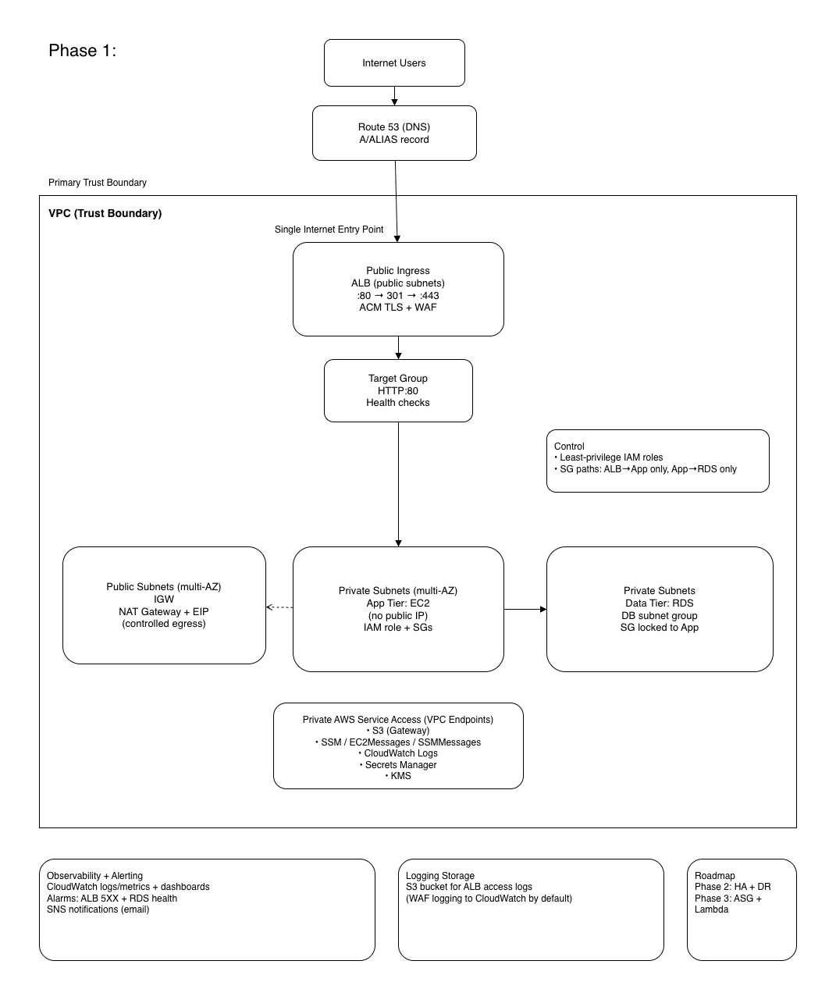

# Phase 1 – Senior Cloud Solutions Architect Interview Script with 2 approaches: a Whiteboard walkthrough and an Exectutive Architectrue walkthrough

## Candidate: Dennis
## Role Positioning: Senior Cloud Solutions Architect
## Deployment Method: Terraform (Infrastructure as Code)
## Architecture Style: Secure 3-Tier AWS Architecture:

Phase 1 establishes deterministic infrastructure — networking, IAM, routing, and data stability. Elasticity and automation are layered in later phases once the foundation is validated.

---
# Section 1: Phase 1 Architecture – Whiteboard walkthrough




A whiteboard is a LIVE problem-solving conversation where you think out loud while modeling a system. It focuses on your flow and decisions and answers how you think.

They want to see:
- Where you start
- What you prioritize
- What tradeoffs you consider
- How you evolve the system

## 60–90 Second Whiteboard Explanation (walk through)

This is Phase 1 of a production architecture roadmap.  
The objective here is to establish a secure, deterministic foundation before introducing elasticity or automation.

Starting from the left, users resolve DNS through Route 53.  
Route 53 directs traffic to a public Application Load Balancer.

The ALB is the only internet-facing component.  
It redirects HTTP to HTTPS, terminates TLS using an ACM certificate, and has a regional WAF attached to filter malicious traffic before anything reaches the VPC.

From the ALB, traffic flows deeper into the private subnets, which acts as the primary trust boundary.

Inside the VPC, the application tier runs on EC2 instances in private subnets.  
There are no public IPs attached to the application layer.  
Access is controlled through security groups and IAM roles to enforce least-privilege access.

The application tier communicates with the data tier, which is Amazon RDS.  
RDS also resides in private subnets and only accepts traffic from the application security group.  
There is no direct database exposure to the internet.

For outbound AWS service communication, NAT exists as a controlled egress path.  
However, I reduce NAT dependency by using VPC endpoints for S3, SSM, CloudWatch Logs, Secrets Manager, and KMS.  
This keeps management, logging, and secrets traffic inside AWS private networking.

Production readiness is built into the foundation.  
CloudWatch handles logging and metrics, alarms monitor ALB 5XX errors and RDS health, and SNS provides alert notifications.

This phase validates networking, IAM trust boundaries, controlled ingress, deterministic traffic flow, and data layer stability.

Phase 2 introduces high availability and disaster recovery strategy.  
Phase 3 introduces elasticity through Auto Scaling Groups and event-driven automation using Lambda.

I do not scale uncertainty.  
I validate the foundation first, then layer resilience, then elasticity.

---
# Whiteboard Q&A
# 1. Why is the ALB your single entry point?

### What they’re testing:
Ingress control and attack surface understanding.

### Strong answer:
Centralizing ingress through the ALB reduces attack surface and simplifies TLS enforcement, WAF attachment, and logging. It ensures all internet traffic is inspected and routed deterministically before reaching private infrastructure.

---

# 2. Why didn’t you put EC2 in public subnets?

### What they’re testing:
Network isolation and security modeling.

### Strong answer:
Public subnets expose resources to the internet via route tables. Application instances do not require direct inbound internet access. Keeping them private enforces controlled ingress through the ALB and reduces blast radius.

---

# 3. Why use NAT if you already have VPC endpoints?

### What they’re testing:
Understanding of gateway vs interface endpoints.

### Strong answer:
VPC endpoints handle private AWS service access, but NAT is still required for outbound internet traffic such as OS updates or external APIs. Endpoints reduce NAT dependency but do not eliminate the need for outbound internet entirely.

---

# 4. What happens if NAT fails?

### What they’re testing:
High availability awareness.

### Strong answer:
If a single NAT fails, outbound internet traffic from affected subnets fails. In production, I would deploy one NAT per AZ and align route tables accordingly to reduce single points of failure.

---

# 5. Why is Route 53 outside the VPC?

### What they’re testing:
Control plane vs data plane understanding.

### Strong answer:
Route 53 is a global managed service and part of the AWS control plane. It does not reside inside a VPC. It resolves DNS and directs traffic to VPC-based resources.

---

# 6. Why is the Target Group separate from the ALB?

### What they’re testing:
Load balancer architecture knowledge.

### Strong answer:
The target group abstracts backend instances and performs health checks. It decouples routing rules from compute resources and allows scaling or replacement without reconfiguring listeners.

---

# 7. What is your primary trust boundary?

### What they’re testing:
Security modeling.

### Strong answer:
The VPC is the primary trust boundary. Everything inside it is segmented further using subnets and security groups. The ALB acts as a controlled ingress boundary.

---

# 8. Why no Auto Scaling yet?

### What they’re testing:
Architectural sequencing maturity.

### Strong answer:
Phase 1 validates deterministic networking and data stability. I avoid introducing elasticity before confirming traffic flow and IAM boundaries. Scaling unstable systems amplifies instability.

---

# 9. What is your blast radius if the App tier is compromised?

### What they’re testing:
Zero-trust thinking.

### Strong answer:
Security groups restrict east-west traffic. The app can only communicate with RDS on required ports and AWS services via endpoints. It has no public IP and limited IAM permissions. Compromise is contained to its subnet and IAM scope.

---

# 10. How would you make this multi-region?

### What they’re testing:
Strategic scaling and disaster recovery planning.

### Strong answer:
I would replicate the VPC stack in another region, use Route 53 health checks with failover routing, implement cross-region data replication, and replicate logging infrastructure.

---

# 11. Why attach WAF at ALB and not CloudFront?

### What they’re testing:
Edge vs regional architecture decisions.

### Strong answer:
In this design, ALB is the internet entry point, so WAF is attached regionally. If CloudFront were introduced later, WAF would move to the edge for earlier traffic filtering.

---

# 12. If traffic increases 10x tomorrow, what breaks?

### What they’re testing:
Bottleneck identification.

### Strong answer:
The single EC2 instance and database IOPS would likely become bottlenecks. Phase 3 introduces Auto Scaling Groups and potential database scaling strategies to address this.

---

# 13. Why not use Lambda instead of EC2?

### What they’re testing:
Appropriateness of serverless.

### Strong answer:
Lambda is well-suited for event-driven workloads. This design assumes persistent processes and stable database connections. Introducing Lambda prematurely would add cold start and concurrency considerations without solving a defined constraint.

---

# 14. Where does IAM enforcement actually happen?

### What they’re testing:
Deep AWS understanding.

### Strong answer:
IAM enforcement occurs at the AWS control plane when a service makes an API call. EC2 instances assume IAM roles, and AWS evaluates the attached policies before allowing access.

---

# 15. What’s missing from this diagram?

### What they’re testing:
Architectural self-awareness.

### Strong answer:
Disaster recovery policy, backup strategy, patch management automation, centralized logging aggregation, CI/CD integration, and formalized security scanning are not represented in Phase 1.

---

# Final Challenge Question

## Convince me this is production-ready.

### Strong answer:
It is production-ready for controlled load. It enforces least privilege, private networking, deterministic ingress, monitored health, and structured logging. It is intentionally phased to introduce high availability and elasticity after baseline validation.

---

# Senior Architect Principle

I do not scale uncertainty.  
I validate networking, trust boundaries, traffic flow, and data stability first.  
Resilience and elasticity are layered after the foundation is proven stable.

.

.

.

.


---
# SECTION 2 — Executive Architecture Walkthrough

## 1. Walk me through your architecture from DNS resolution to database interaction.

### Ideal Answer Example:


```text
When a user accesses the domain, Route 53 resolves DNS and directs the request to the 
internet-facing Application Load Balancer (ALB).

The ALB is the single public entry point. It redirects HTTP to HTTPS, terminates TLS 
using an ACM-issued certificate, and has a regional AWS WAF attached to filter malicious 
requests before they reach the application tier.

The ALB forwards traffic to a Target Group, which routes requests to EC2 instances 
running in private subnets with no public IPs. Security groups enforce that the 
application tier only accepts inbound traffic from the ALB.

Each EC2 instance assumes an IAM role via an instance profile. The application uses 
that role to retrieve database credentials securely from AWS Secrets Manager. The secret 
is encrypted at rest with KMS and decrypted transparently by Secrets Manager at retrieval 
time. In this phase, Terraform seeds the initial secret value; in production, I would 
generate credentials dynamically and enable rotation.

With credentials retrieved, the application connects to Amazon RDS, deployed in private 
subnets and not publicly routable. Database security groups restrict inbound access 
strictly to the application security group, typically limited to the database port.

For AWS service connectivity, VPC endpoints — including an S3 gateway endpoint and 
interface endpoints for SSM, CloudWatch Logs, Secrets Manager, and KMS — keep service 
traffic within private AWS networking and minimize NAT usage. NAT remains the controlled 
egress path for required internet-bound traffic such as OS updates or external APIs.

CloudWatch alarms monitor ALB 5XX errors and an application-level database connection 
error metric, with notifications delivered via SNS.

Overall, the design emphasizes segmentation between public and private subnets, 
least-privilege IAM, tightly scoped security groups, controlled ingress and egress 
paths, and defense in depth through WAF, monitoring, and logging.
```
---

# SECTION 2 — Architectural Decisions

## 2. Why did you use an Application Load Balancer instead of exposing EC2 directly?

### Ideal Answer Example:

```text
Using an ALB provides:

- TLS termination via ACM
- Integration with AWS WAF
- Health checks
- Abstraction of compute from ingress
- Scalability flexibility
- Improved security posture

Exposing EC2 directly would increase attack surface
and tightly couple compute to public ingress.
```

---

## 3. Why are EC2 and RDS deployed in private subnets?

### Ideal Answer Example:

```text
Private subnets prevent direct internet access.

EC2 instances receive traffic only through the ALB, 
not from the internet.

RDS is isolated from public exposure and can only 
be accessed from the application tier via security 
group rules.

This reduces attack surface and enforces least 
exposure principles.
```
---

# SECTION 3 — Networking Deep Dive

## 4. Explain your VPC and subnet design.

### Ideal Answer Example:

```text
The VPC is segmented into public and private subnets.

**Public subnets contain:**
- Application Load Balancer
- NAT Gateway

**Private subnets contain:**
- EC2
- RDS

Public subnets route 0.0.0.0/0 to the Internet Gateway.

Private subnets route outbound traffic through the 
NAT Gateway, allowing outbound internet access without 
inbound exposure.
```

---

## 5. What would break if the NAT Gateway failed?

### Ideal Answer Example:

```text
Private EC2 instances would lose outbound internet
connectivity.

Impacts may include:

- OS patching failures
- Package installation failures
- External API connectivity issues
- Potential Secrets Manager API calls failing if no
VPC endpoint exists

Inbound traffic from the ALB would still function.
```

---

# SECTION 4 — IAM & Secrets Management

## 6. How does the EC2 instance securely retrieve database credentials?

### Ideal Answer Example:
```text
The EC2 instance is associated with an 
IAM role via an instance profile.

The role grants scoped permissions to retrieve 
a specific secret ARN from AWS Secrets Manager.

The application makes an API call to Secrets 
Manager at runtime to retrieve credentials securely.

No static credentials exist in Terraform code, 
user data scripts, or the AMI.

This supports secure rotation and prevents 
credential leakage.
```

---

## 7. Explain the IAM trust relationship used in your design.

### Ideal Answer Example:

```text
The IAM role includes a trust policy 
allowing the EC2 service principal to assume it.

The permissions policy attached to the role 
grants least privilege access to Secrets Manager.

Permissions are scoped to specific resource 
ARNs rather than wildcard access.
```

---

# SECTION 5 — Database Design & Resilience

## 8. Why did you choose RDS instead of self-managed MySQL on EC2?

### Ideal Answer Example:

```text
RDS provides:

- Automated backups
- Managed patching
- Monitoring
- Failover capability (if Multi-AZ enabled)
- Reduced operational overhead

Self-managing MySQL would increase administrative 
complexity and risk.
```

---

## 9. How is the database protected from direct access?

### Ideal Answer Example:

```text
RDS is deployed in private subnets.

It has no public IP.

Security groups allow inbound access only from the 
EC2 security group on the required port.

There is no route from the internet to the RDS subnet.
```
---

## 10. Is this database highly available?

### Ideal Answer Example:

```text
If deployed Single-AZ, it is not fully highly available 
and would experience downtime during AZ failure.

In production, I would enable Multi-AZ deployment to 
allow automatic failover.

This phaseprioritizes architectural design over full 
HA implementation.
```

---

# SECTION 6 — Observability & Alerting

## 11. What monitoring mechanisms are implemented?

### Ideal Answer Example:

```text
CloudWatch monitors:

- EC2 CPU utilization
- ALB target health
- RDS metrics
- Network throughput

CloudWatch alarms trigger SNS notifications when 
thresholds are exceeded.

This provides operational visibility and proactive 
alerting.
```
---

## 12. How does the alarm-to-notification flow work?

### Ideal Answer Example:

```text
CloudWatch detects a metric threshold breach.

The alarm changes state.

The SNS topic is triggered.

Subscribers receive notifications for operational response.
```
---

# SECTION 7 — Security Architecture

## 13. What security layers protect your system?

### Ideal Answer Example:

```text
Defense in depth includes:

- Route 53 DNS control
- HTTPS via ACM
- AWS WAF at ALB layer
- Security groups (stateful firewall)
- Private subnets
- IAM least privilege policies
- Secrets Manager credential isolation
- CloudWatch monitoring

Each layer reduces exposure and enforces segmentation.
```
---

# SECTION 8 — Scalability & Limitations

## 14. What is the biggest scalability limitation in this architecture?

### Ideal Answer Example:

```text
The architecture currently uses a single EC2 instance 
without an Auto Scaling Group.

This introduces a compute bottleneck and single point 
of failure.

In production, I would implement an ASG across multiple AZs.
```
---

## 15. How would you redesign this for 10x traffic growth?

### Ideal Answer Example:

```text
- Implement Auto Scaling Group
- Deploy EC2 across multiple AZs
- Enable Multi-AZ RDS
- Add read replicas if needed
- Consider ElastiCache for read-heavy workloads
- Introduce CloudFront for edge caching

The goal would be horizontal scaling and removal 
of single points of failure.
```
---

# SECTION 9 — Cost Awareness

## 16. What is likely the most expensive component?

### Ideal Answer Example:

```text
The NAT Gateway typically incurs significant cost due to 
hourly charges and data processing.

RDS and ALB also contribute meaningfully to cost.

Understanding cost drivers is essential in production
architecture.
```

---

## 17. How would you reduce cost responsibly?

### Ideal Answer Example:

```text
- Use VPC endpoints to reduce NAT traffic
- Rightsize instances
- Implement autoscaling
- Use Savings Plans or Reserved Instances
- Evaluate Aurora Serverless for variable workloads

Cost optimization must not compromise security or reliability.
```

---

# SECTION 10 — Senior Architect Challenge

## 18. Is this production-ready?

### Ideal Answer Example:

```text
The architecture demonstrates production-grade security
segmentation and infrastructure-as-code discipline.

However, to be fully production-ready, it would require:

- Auto Scaling Group
- Multi-AZ deployment across all tiers
- Centralized log aggregation
- CI/CD pipeline
- Backup testing validation
- WAF rule tuning

It is architecturally sound but requires resilience 
enhancements.
```

---

### What Was Your Primary Contribution?

```text
example 1 (simple):
-“I led the documentation and architecture visualization 
for the project, translated the infrastructure design into 
Terraform scripts, and executed the full deployment of 
the environment.”

example 2 (pro):
-“I took ownership of the architectural documentation and
diagramming to clearly articulate the system design. I
translated the infrastructure requirements into Terraform
modules, authored the deployment scripts, and executed the 
full environment provisioning. I also validated network
segmentation IAM role assumptions, and service integrations
to ensure the build aligned with secure, production-style
architecture principles.”
```

### Did you just deploy it, or did you design parts of it?
```text
You can say:

“While we collaborated on the conceptual design, I was 
primarily responsible for formalizing the architecture into
documentation and diagrams, implementing the Terraform
configuration, and executing the infrastructure deployment.
ensured the final implementation matched the intended security
and networking design.”
```
