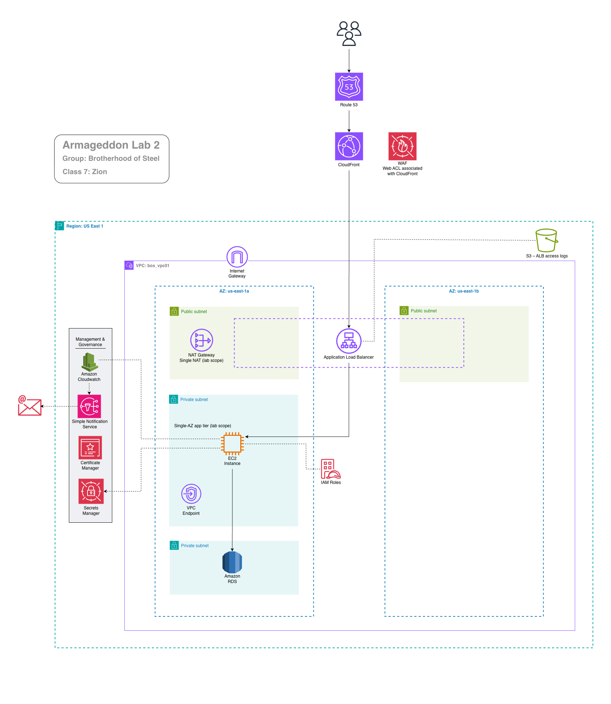
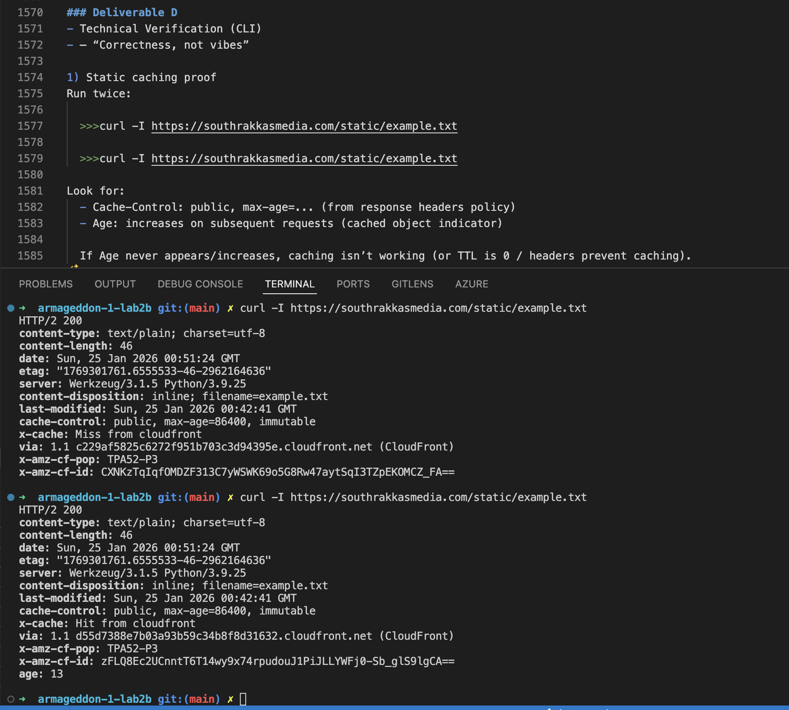
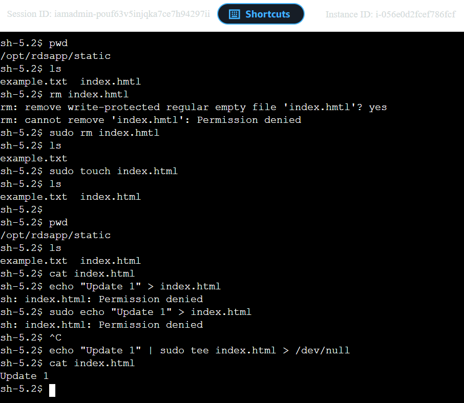
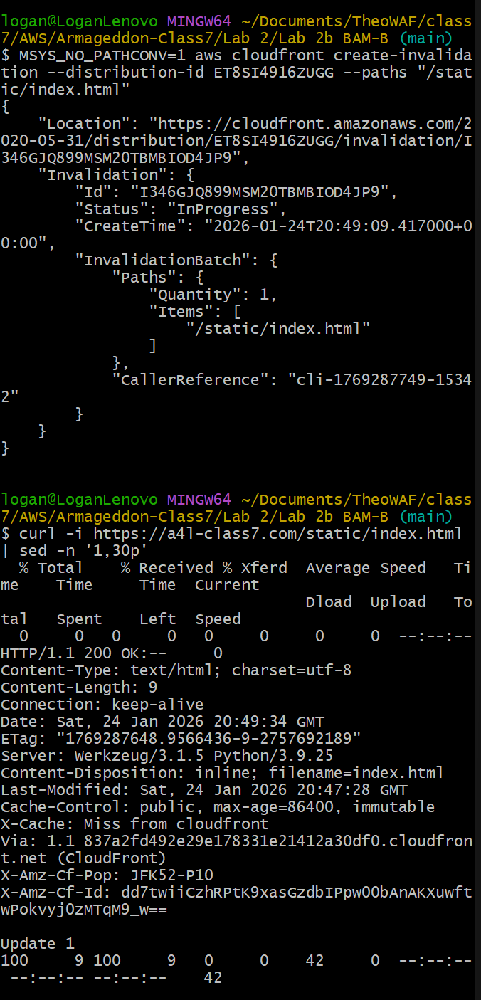

# Armageddon lab 2 | Class 7: Zion | AGroup: Brotherhood Of Steel

<sup>lab 2 diagram</sup>

## Architecture Description

This architecture deploys a secure, multi-AZ application in us-east-1 with CloudFront as the only publicly reachable entry point. User traffic is resolved through Route 53 and delivered to CloudFront, where AWS WAF (WAFv2, CloudFront scope) enforces edge protection before requests are forwarded to an internet-facing Application Load Balancer.

The ALB is intentionally cloaked to prevent direct access: its security group allows inbound traffic only from the AWS-managed CloudFront origin-facing prefix list, and the listener requires a custom header added exclusively by CloudFront. The ALB routes validated traffic to EC2 instances running in private subnets, ensuring the application layer is not directly internet-exposed.

Private EC2 instances retrieve secrets from AWS Secrets Manager via a VPC interface endpoint, avoiding public service access, while outbound internet access (when required) is provided through a NAT Gateway. Application data is stored in Amazon RDS within private subnets, and monitoring and alerting are handled through Amazon CloudWatch and Amazon SNS using IAM roles for secure, credential-free access.

----

### Verification CLI (students must prove all 3 requirements)

### 1. “VPC is only reachable via CloudFront”

**A) Direct ALB access should fail (403)**

```bash
curl -I https://<ALB_DNS_NAME>
```

Expected: 403 (blocked by missing header)

sc<sup>56-1</sup>

**B) CloudFront access should succeed**

```bash
curl -I https://southrakkasmedia.com
```

sc<sup>56-2</sup>

```bash
curl -I https://app.southrakkasmedia.com
```

Expected: 200/301 → 200

sc<sup>56-3</sup>

----

### 2. WAF moved to CloudFront

```bash
aws wafv2 get-web-acl \
--name <project>-cf-waf01 \
--scope CLOUDFRONT \
--id <WEB_ACL_ID>
```

sc<sup>56-4</sup>

And confirm distribution references it:

```bash
aws cloudfront get-distribution \
--id <DISTRIBUTION_ID> \
--query "Distribution.DistributionConfig.WebACLId"
```

Expected: WebACL ARN present.

sc<sup>56-5</sup>

----

### 3. southrakkasmedia.com points to CloudFront

```bash
dig southrakkasmedia.com A +short

dig app.southrakkasmedia.com A +short
```

Expected: resolves to CloudFront (you’ll see CloudFront anycast behavior, not ALB IPs)

sc<sup>56-6</sup>

# Lab 2b

### Deliverable B — Correctness Proof (CLI evidence)

**A) curl -I outputs for:**

- /static/example.txt (must show cache hit behavior)
- /api/list (must NOT cache unsafe content)

---

**B) A short written explanation:**

Q: “What is my cache key for /api/* and why?”

For /api/* paths (handled by the default * CloudFront behavior with the bos-cache-api-disabled01 cache policy), the cache key is effectively unique per request or bypassed entirely (no shared caching occurs). This policy likely sets a Minimum TTL of 0 seconds, excludes no varying elements from the key (or includes all via the bos-orp-api01 origin request policy), and honors the origin's Cache-Control: no-cache, no-store, must-revalidate, private headers—resulting in always-miss behavior (as seen in curl outputs: x-cache: Error from cloudfront or Miss on retries).
Why? API endpoints return dynamic, user-specific data (e.g., personalized notes from RDS via /api/list), which changes per request based on DB state or auth. A simple URL-only cache key would risk serving stale/incorrect data or leaking sensitive info across users (e.g., cache poisoning). By making the key unique (via forwarded varying headers/cookies/query strings) or disabling caching (TTL=0 + no-store), we ensure every request fetches fresh content from the origin for security, correctness, and real-time accuracy.


Q: “What am I forwarding to origin and why?”

I forward all viewer headers, cookies, and query strings to the origin (via the bos-orp-api01 origin request policy, which appears to be an "AllViewer" or custom equivalent). This includes essentials like Host (for virtual hosting), Authorization (for future auth tokens), Cookie (for sessions), X-Forwarded-For (viewer IP), and any custom params (e.g., ?note=hello in /add). CloudFront adds/removes some by default (e.g., strips X-Forwarded-Proto for security but always adds X-Forwarded-For).
Why? The origin (Flask app) needs these to authenticate/authorize users, parse dynamic queries, and generate correct responses (e.g., DB inserts via Secrets Manager creds). Without them, requests would be treated as anonymous (leading to 401/403 errors or wrong data). Forwarding enables secure, personalized handling while the cache policy ensures no unwanted caching of these variable requests—balancing performance for static paths with reliability for APIs.


---

### Deliverable C - Haiku. You must submit

- Haiku describing Chewbacca's perfections.**
  漢字で。。。英語なし

忠誠無二

### 温眼守護
### 我家至宝

---

### Deliverable D

- Technical Verification (CLI)
- — “Correctness, not vibes”

1) Static caching proof  
Run twice:

```bash
curl -I https://southrakkasmedia.com/static/example.txt

curl -I https://southrakkasmedia.com/static/example.txt
```

Look for:
- Cache-Control: public, max-age=... (from response headers policy)
- Age: increases on subsequent requests (cached object indicator)

If Age never appears/increases, caching isn’t working (or TTL is 0 / headers prevent caching).

sc<sup>57-1</sup>

2) API must NOT cache unsafe output  
Run twice:

```bash
curl -I https://southrakkasmedia.com/api/list

curl -I https://southrakkasmedia.com/api/list
```

Expected for “safe default” API behavior:
- Age should be absent or 0
- Responses should reflect fresh origin behavior
- If you add auth later, you must never allow one user to see another’s response

sc<sup>57-3</sup>

3) Cache key sanity checks (query strings)  
Static should ignore query strings by default:

```bash
curl -I "https://southrakkasmedia.com/static/example.txt?v=1"

curl -I "https://southrakkasmedia.com/static/example.txt?v=2"
```

Expected:
- both map to the same cached object (hit ratio stays high) because static cache policy ignores query strings (unless students intentionally change it)

sc<sup>57-4</sup>

4) “Stale read after write” safety test

- If your API supports writes:
  - POST a new row
  - Immediately GET /api/list
  - Ensure the new row appears
    - If it doesn’t, they accidentally cached a dynamic response.

sc<sup>57-5</sup>

# Lab 2b - Be A Man Challenge A

## Honors Verification (students must prove origin-driven caching)

### 1) Prove CloudFront is honoring origin Cache-Control

**A) First request should be MISS**

```bash
curl -i https://southrakkasmedia.com/api/public-feed | sed -n '1,20p'
```

Check headers:
- Cache-Control:
  - public,
  - s-maxage=30,
  - max-age=0 (from origin)
  - x-cache: Miss from cloudfront (or similar)
  - Age: likely absent or 0

x-cache meanings are documented by AWS

sc<sup>58-1</sup>

**B) Second request within 30 seconds should be HIT**

```bash
curl -i https://southrakkasmedia.com/api/public-feed | sed -n '1,20p'
```

Expected:
- x-cache: Hit from cloudfront
- Age: increases on subsequent hits (cache indicator)
- Body should remain identical until TTL expires

sc<sup>58-2</sup>

**C) After 35 seconds, it should MISS again**


sleep 35

```bash
curl -i https://southrakkasmedia.com/api/public-feed | sed -n '1,20p'
```

Expected:
- x-cache becomes Miss or RefreshHit
- Body updates

sc<sup>58-3</sup>

### 2) Prove “no-store” never caches (safety proof)

```bash
curl -i https://southrakkasmedia.com/api/list | sed -n '1,30p'

curl -i https://southrakkasmedia.com/api/list | sed -n '1,30p'
```

Expected:
- Cache-Control: private, no-store
- No meaningful cache hit behavior (Age not growing / no Hit)
- Each request should reflect origin state

If a student gets a cache HIT here, it’s a fail (potential data leak).

sc<sup>58-4</sup>

----

Q. Why origin-driven caching is safer for APIs? When would you still disable caching entirely?

Origin-driven caching is considered safer for APIs because it ensures the backend (origin) remains the authoritative source of truth for security policies, data validation, cache invalidation, and how long the data is allowed to live. This ensures users receive the latest information rather than stale, outdated, inccorect or unauthorized data. You would disable caching entirely when the data changes frequently or instantly, such as stock prices, live tracking, or real-time sensor data, as serving stale data is unacceptable. Also, sensitive personalized data such as medical records, authentication, authorization, where you don't want data leaks and active development and testing where you need the latest changes immediately.

----

# Lab 2b - [Be A Man Challenge B](https://github.com/DennistonShaw/armageddon/blob/main/SEIR_Foundations/LAB2/2b_Be_A_ManB.txt)

## Part A — Add “break glass” invalidation procedure (CLI)

**A1) Create an invalidation (single path)**

----

```bash
aws cloudfront create-invalidation \
--distribution-id <DISTRIBUTION_ID> \
--paths "/static/index.html"
```

AWS shows this exact CLI pattern.

sc<sup>59-1</sup>

**A2) Create an invalidation (wildcard path)**

```bash
aws cloudfront create-invalidation \
  --distribution-id <DISTRIBUTION_ID> \
  --paths "/static/*"
```

Wildcards are allowed, but must be last character and paths must start with /

Documentation:
- [What you need to know when invalidating files](https://docs.aws.amazon.com/AmazonCloudFront/latest/DeveloperGuide/invalidation-specifying-objects.html?utm_source=chatgpt.com)

sc<sup>59-2</sup>

**A3) Track invalidation completion**

```bash
aws cloudfront get-invalidation \
--distribution-id <DISTRIBUTION_ID> \
--id <INVALIDATION_ID>
```

sc<sup>59-3</sup>

## Part B — “Correctness Proof” checklist (must submit)

**B1) Before invalidation: prove object is cached**

```bash
curl -i https://southrakkasmedia.com/static/index.html | sed -n '1,30p'

curl -i https://southrakkasmedia.com/static/index.html | sed -n '1,30p'
```

Expected:
- Age increases on second request (cached)
- x-cache shows Hit from cloudfront (or similar)
- AWS documents cache result types and hit/miss concepts.

Documenatation: https://docs.aws.amazon.com/AmazonCloudFront/latest/DeveloperGuide/cache-statistics.html?utm_source=chatgpt.com

sc<sup>59-4b</sup>

**B2) Deploy change (simulate)**

sc<sup>59-6b</sup>

- now create invalidation

```
aws cloudfront create-invalidation \
--distribution-id <DISTRIBUTION_ID> \
--paths "/static/index.html"
```

Distribution id: EYEZI7L9EMMDQ (Console > CloudFront > Distributions > choose from your distributions)

sc<sup>59-7</sup>

**B3) After invalidation: prove cache refresh**

Run invalidation for /static/index.html, then run:

```bash
curl -i https://southrakkasmedia.com/static/index.html | sed -n '1,30p'
```

Expected:
- x-cache is Miss or RefreshHit depending on TTL/conditional validation
- CloudFront standard logs define Hit, Miss, RefreshHit.

Documentation: [Standard logging reference](https://docs.aws.amazon.com/AmazonCloudFront/latest/DeveloperGuide/standard-logs-reference.html?utm_source=chatgpt.com)

sc<sup>59-8b</sup>

## Part C — Terraform “framework” (two options)

**Option 1 (Recommended):**
- Keep invalidations as manual runbook ops
- Terraform should not constantly invalidate on apply; that trains bad habits.

## Part D — Incident Scenario (graded)

- Scenario: “Stale index.html after deployment”
  - Symptoms:
    - users keep receiving old index.html which references old hashed assets
    - static asset caching works, but the HTML entrypoint is stale

### Required student response

- Confirm caching (Age, x-cache)

Q: Explain why versioning is preferred but why entrypoint sometimes needs invalidation

```text
Versioning is preferred because it ensures stability, allows for easy rollbacks, and prevents compatibility issues. However, the "entrypoint" (such as an index.html) sometimes needs to be invalidated (forced to refresh) to prevent users from interacting with stale, cached, or broken code.
```

Q: Why do we Invalidate /static/index.html only (not /*)?

```text
For efficiency to change invalidate only the file that needs to be changed. Doing more is slower, costs more and adds no benefit. It also ensures that users always receive the latest entry point of the application.
```

## Part E — “Smart” upgrade (extra credit)

**E1) Explain when not to invalidate**
- If the only changed files are versioned assets like:
  - /static/app.9f3c1c7.js
then invalidation is unnecessary. AWS recommends versioned names for frequent updates.

AWS Documentation: [Invalidate files to remove content](https://docs.aws.amazon.com/AmazonCloudFront/latest/DeveloperGuide/Invalidation.html?utm_source=chatgpt.com)

**E2) Create “invalidation budget”**
- Students must state:
  - monthly invalidation path budget (e.g., 200)
  - allowed wildcard usage conditions
  - approval workflow for /*

**Invalidation Budget Policy**

Each team must define a monthly invalidation path budget (default: 200 paths/month) to control cost and reduce cache churn; usage is tracked and reviewed weekly. Wildcard invalidations /* are normally prohibited and permitted only for documented emergencies (e.g., security incident, corrupted cache affecting most users, or origin rollback failure). Any /* request requires a short incident note, two-person approval (service owner + platform/lead), and a post-action review explaining root cause and prevention to avoid repeat use.

### Student Submission (Honors+)

**Students submit:**

1) CLI command used (create-invalidation) + invalidation ID  
   Documentation:
   - [Use CreateInvalidation with a CLI](https://docs.aws.amazon.com/AmazonCloudFront/latest/DeveloperGuide/example_cloudfront_CreateInvalidation_section.html?utm_source=chatgpt.com)

2) Proof of cache before + after (headers showing Age/x-cache)  
   Documentation:
   - [Standard logging reference](https://docs.aws.amazon.com/AmazonCloudFront/latest/DeveloperGuide/standard-logs-reference.html?utm_source=chatgpt.com)

3) A 1-paragraph policy:
   - “When do we invalidate?”
   - “When do we version instead?”
   - “Why is /* restricted?”

We invalidate CloudFront objects only when a change must be visible immediately at a fixed URL (for example, /static/index.html or a critical config file), and we scope invalidations to the smallest possible path to minimize cost and blast radius. We use versioning (hashed filenames like /static/app.9f3c1c7.js) for all other static assets so updates are picked up automatically without invalidations, enabling long cache TTLs and better performance. The wildcard invalidation /* is restricted because it flushes the entire cache, is expensive, increases origin load, and can cause widespread latency spikes or outages; it should be reserved for rare, emergency scenarios only and require explicit approval.

---
