# [Lab 3a](https://github.com/DennistonShaw/armageddon/tree/main/SEIR_Foundations/Lab3)

I designed a cross-region medical system where all PHI remained in Japan to comply with APPI. Tokyo hosted the database, São Paulo ran stateless compute, and Transit Gateway provided a controlled data corridor. CloudFront delivered a single global URL without violating data residency.

<sup>lab3 diagram</sup>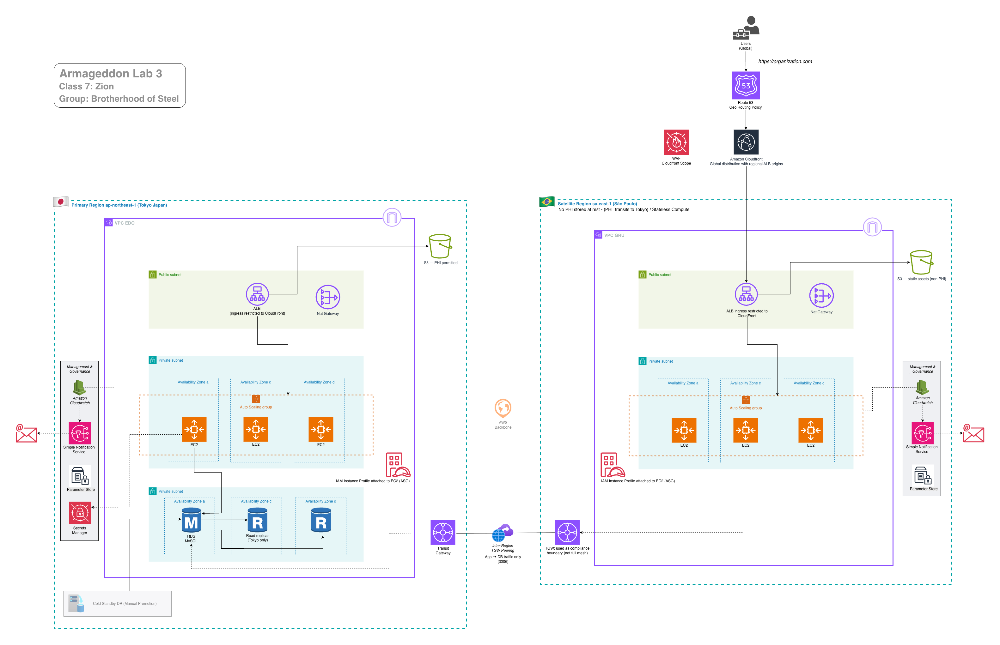

---

## Architecture Justification

This architecture demonstrates a compliant multi-region design for a regulated medical workload. Global access is provided through CloudFront, while compute is deployed across a primary region (Tokyo) and a satellite region (São Paulo). To satisfy data residency requirements, all PHI is persisted exclusively in the Tokyo region, which functions as the system of record. The São Paulo region operates stateless compute only and does not store PHI at rest; application read and write operations traverse a Transit Gateway to the Tokyo-hosted RDS database over MySQL (3306). This design explicitly balances regulatory compliance, centralized auditing, and architectural clarity against cross-region latency.

----

# Project Infrastructure:

## 1. Tokyo, Japan

**VPC name  ==** edo_vpc01 (#relace bos with edo)

**Name significance:** The Edo period (1603–1868) marked a turning point in Japanese healthcare, blending traditional Kampo with Western medical knowledge through Rangaku. It laid the foundations of modern medical education, public health practices, and innovative access models like okigusuri (“use first, pay later”).

**Region =** ap-northeast-1  
**Availability Zone:** ap-northeaset-1a, ap-northeaset-1c, ap-northeaset-1d  
**CIDR ==** 10.81.0.0/16

|Subnets|az zone a|az zone c|az zone d|
|---|---|---|---|
|**Public**|10.81.1.0/24|10.81.2.0/24|10.81.3.0/24|
|**Private**|10.81.101.0/24|10.81.102.0/24|10.81.103.0/24|

---

## 2. São Paulo, BRAZIL

**VPC name  ==** gru_vpc01 (#relace bos with gru)

**Name significance:** GRU is the IATA airport code for São Paulo/Guarulhos–Governador André Franco Montoro International Airport, the primary international gateway serving São Paulo, Brazil.

**Region =** sa-east-1  
**Availability Zone:** sa-east-1a, sa-east-1b, sa-east-1c  
**CIDR ==** 10.55.0.0/16

|Subnets|az zone a|az zone b|az zone c|
|---|---|---|---|
|**Public**|10.55.1.0/24|10.55.2.0/24|10.55.3.0/24|
|**Private**|10.55.101.0/24|10.55.102.0/24|10.55.103.0/24|

---

## Test network reachability to Tokyo RDS

```bash
nc -vz edo-rds01.cvw8oc42sa71.ap-northeast-1.rds.amazonaws.com 3306
```

sc<sup>59-f</sup>

---

## App-level verification

- submit record in São Paulo  
- confirm it appears when calling the Tokyo region (same data, one DB)  
- run this in São Paulo  

```bash
curl https://app.southrakkasmedia.com/init
curl https://app.southrakkasmedia.com/add?note=test
curl https://app.southrakkasmedia.com/list
```

sc<sup>60-1</sup>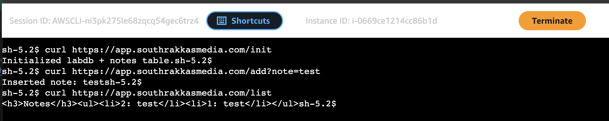

---

## Confirm routes (AWS CLI)

For each region, verify route tables include the cross-region CIDR to TGW.

### 1. Tokyo

```bash
aws ec2 describe-route-tables \
--filters "Name=vpc-id,Values=vpc-07d76c74c6a612724" \
--query 'RouteTables[].{RouteTableId: RouteTableId, Routes: Routes[]}' \
--output table \
--region ap-northeast-1
```

sc<sup>60-2</sup>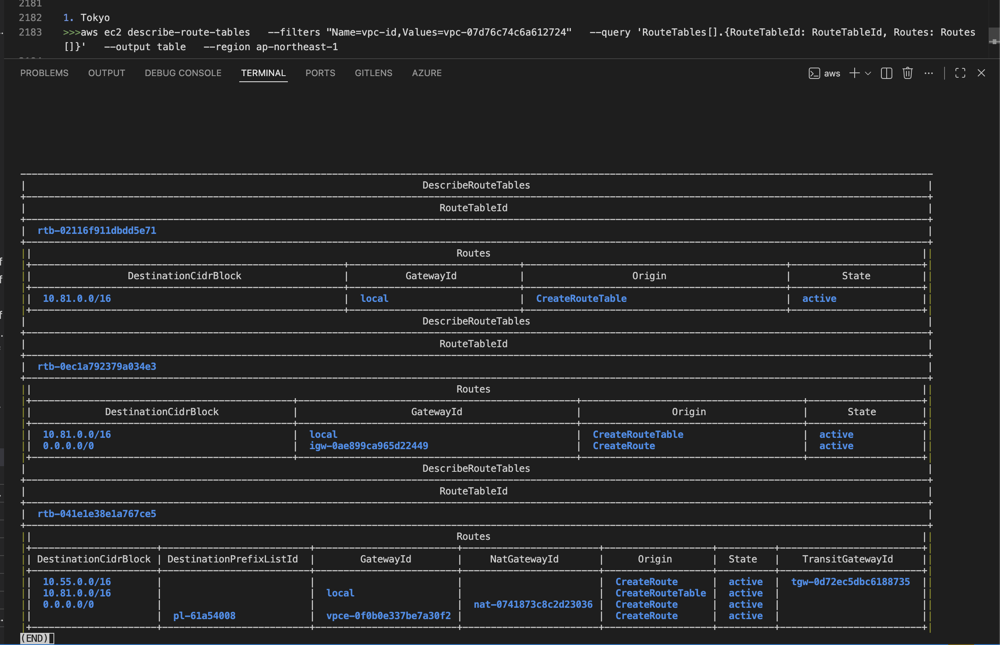

Repeat the command for São Paulo.

### 2. São Paulo (change the VPC ID and region)

```bash
aws ec2 describe-route-tables \
--filters "Name=vpc-id,Values=vpc-0f898c684d227524e" \
--query 'RouteTables[].{RouteTableId: RouteTableId, Routes: Routes[]}' \
--output table \
--region sa-east-1
```

sc<sup>60-3</sup>

---

# Lab 3a Deliverables: 

- [Lab 3 Audit Pack](./python/lab3-audit-pack/)

sc<sup>59-e3</sup>

---

# Deliverables B

## Auditor narrative”  

From an APPI compliance standpoint, this architecture enforces data residency by design. All personally identifiable and health-related data is stored and processed exclusively in the Tokyo (ap-northeast-1) region, where the primary RDS database and replicas reside. The São Paulo region is restricted to stateless compute with no persistent storage, preventing regulated data from being retained or reconstructed outside Japan. Cross-region connectivity is limited to a tightly scoped, encrypted Transit Gateway peering that allows only application-level database access, serving as a compliance boundary rather than a general network mesh. Global services such as Route 53 and CloudFront function solely as routing and delivery layers and do not store or process sensitive data. As a result, cross-border data flow is transient, encrypted, and compliant with APPI cross-border transfer requirements.

---

## Verification Commands (CLI proof students can paste)

### 1) Data residency proof (RDS only in Tokyo)

**Tokyo: RDS exists**

```bash
aws rds describe-db-instances --region ap-northeast-1 \
--query "DBInstances[].{DB:DBInstanceIdentifier,AZ:AvailabilityZone,Region:'ap-northeast-1',Endpoint:Endpoint.Address}"
```

sc<sup>61-1</sup>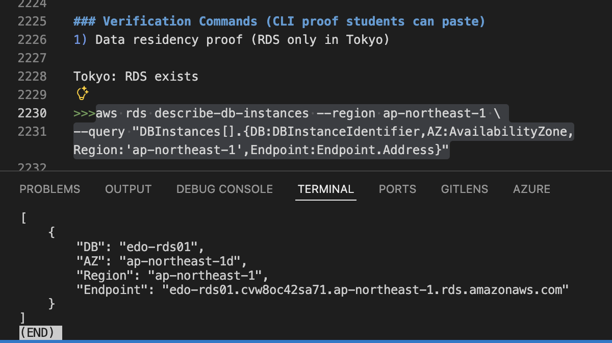

**São Paulo: No RDS**

```bash
aws rds describe-db-instances --region sa-east-1 \
--query "DBInstances[].DBInstanceIdentifier"
```

sc<sup>61-2</sup>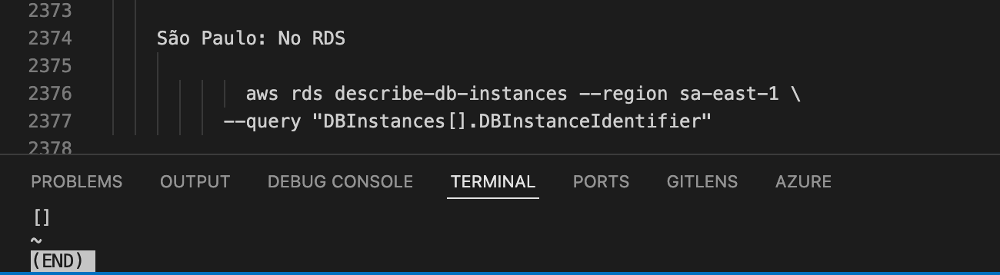

---

### 2) Edge proof (CloudFront logs show cache + access)

Students capture request headers:

```bash
curl -I https://southrakkasmedia.com/api/public-feed
```

And/or submit CloudFront standard log evidence (Hit/Miss/RefreshHit)

sc<sup>61-3</sup>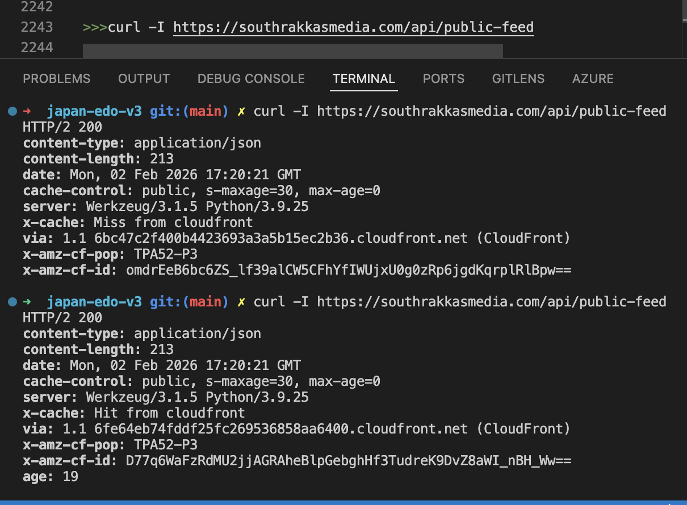

---

### 3) WAF proof

Provide:
- WAF log snippet or Insights summary  
- WAF logging destination options are documented  

```bash
curl -i "https://southrakkasmedia.com/
```

sc<sup>62-1</sup>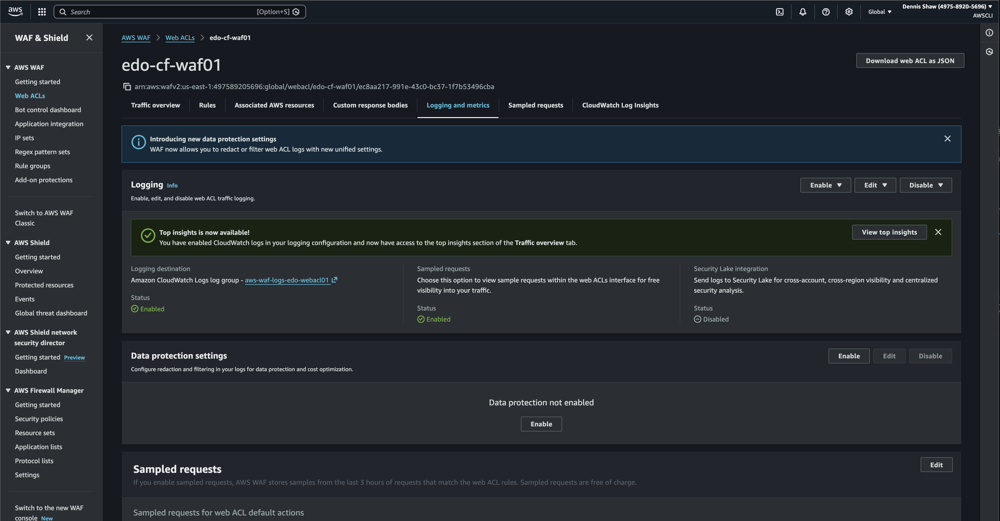    

sc<sup>62-2</sup>  

sc<sup>62-3</sup>    

sc<sup>62-4</sup>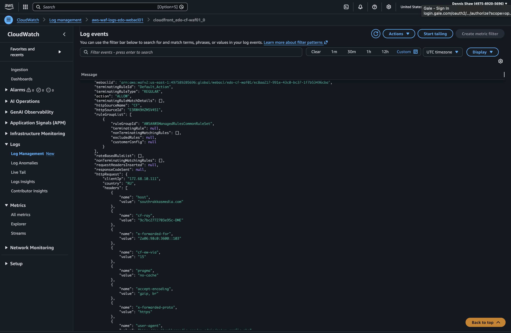  

---

### 4) Change proof (CloudTrail)

CloudTrail has event history with a 90-day immutable record of management events.

Students capture:  
→ “who changed SG / TGW route / WAF / CloudFront config”

sc<sup>62-4b</sup>

---

### 5) Network corridor proof (TGW)

Students prove:
- TGW attachments exist in both regions  
- routes point cross-region CIDRs to TGW  

```bash
aws ec2 describe-transit-gateways \
--region ap-northeast-1
```

sc<sup>64-1</sup>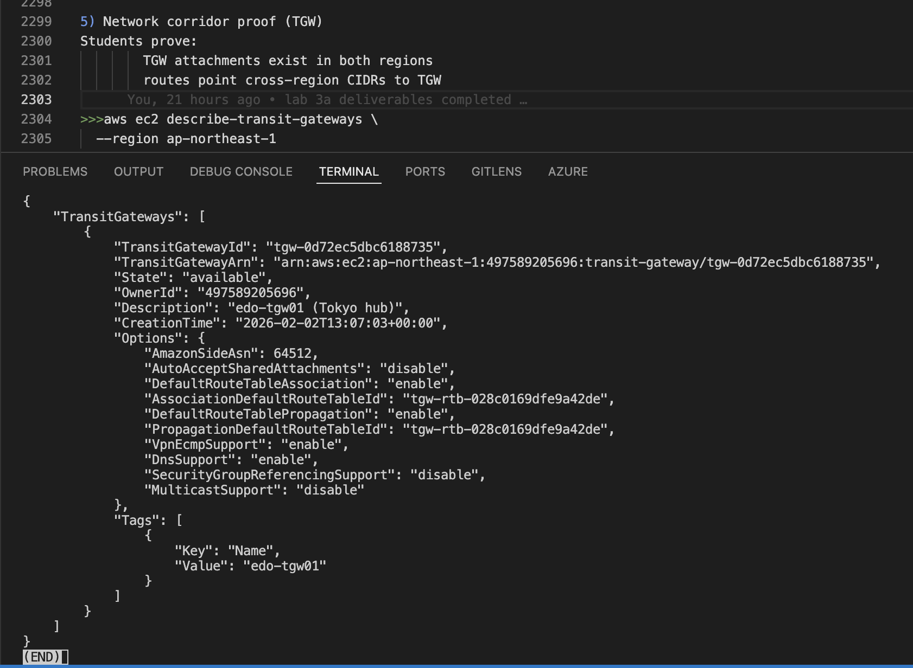

```bash
aws ec2 describe-transit-gateways \
--region sa-east-1
```

sc<sup>64-2</sup>

```bash
aws ec2 describe-transit-gateway-vpc-attachments \
--region ap-northeast-1
```

sc<sup>64-3</sup>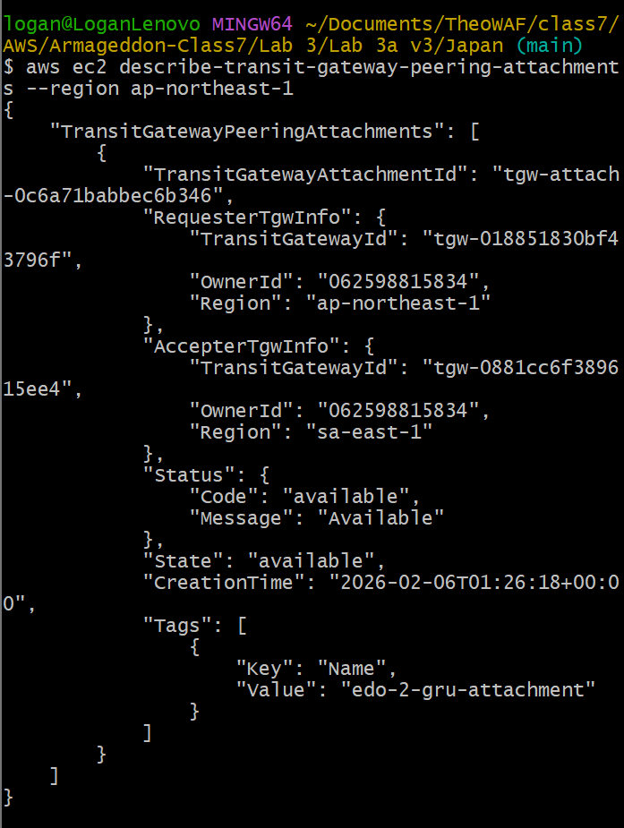

```bash
aws ec2 describe-transit-gateway-vpc-attachments \
--region sa-east-1
```

sc<sup>64-4</sup>  
sc<sup>64-4b</sup>  
sc<sup>64-4b</sup>

---

### 6) AWS CLI verification (students can prove the bucket/logs exist)

Original file, must put your own path.

**Tokyo**

```bash
aws s3 ls s3://edo-alb-logs-497589205696/alb-access-logs/AWSLogs/497589205696/
```

**São Paulo**

```bash
aws s3 ls s3://gru-alb-logs-497589205696/alb-access-logs/AWSLogs/497589205696/
```

sc<sup>64-5</sup>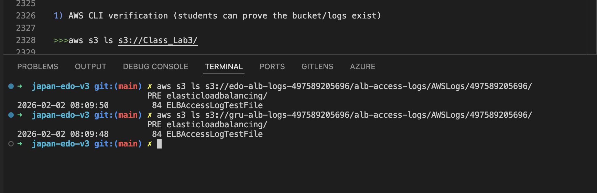

```bash
aws s3 ls s3://Class_Lab3/cloudfront-logs/ --recursive | tail -n 20
```

**Download one file manually (sanity check)**  
You can go to the console and download it manually or use this code with the full path and a local destination.

```bash
aws s3 cp "s3://edo-alb-logs-497589205696/alb-access-logs/AWSLogs/497589205696/elasticloadbalancing/ap-northeast-1/2026/02/02/497589205696_elasticloadbalancing_ap-northeast-1_app.edo-alb01.17a87258ea93047b_20260202T1315Z_35.75.116.37_4dbrxv5c.log.gz" \
"$HOME/Downloads/"
```

sc<sup>64-6</sup>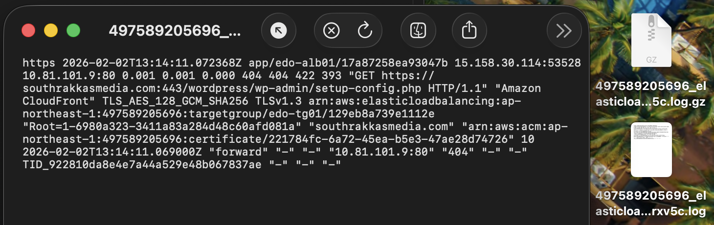

---

## Scripts

### Script 1 — malgus_residency_proof.py

Creates a “DB only in Tokyo” proof file.

**Run this in the Python folder**

- first copy and post my folder name malgus_residency_proof.py  
- open terminal (VS Code) in the Python folder  

Verify AWS credentials:

```bash
aws sts get-caller-identity
```

sc<sup>64-9a</sup>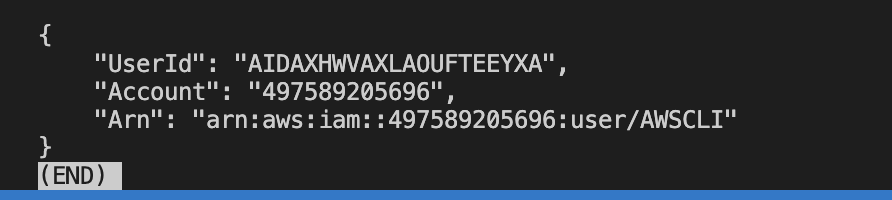

Install dependency (one time only):

```bash
pip3 install boto3
```

Make the script executable:

```bash
chmod +x malgus_residency_proof.py
```

Run:

```bash
python3 malgus_residency_proof.py --db-id edo-rds01
```

sc<sup>64-9b</sup>

```bash
python3 malgus_residency_proof.py \
  --db-id edo-rds01 \
  --strict-empty-saopaulo
```

sc<sup>64-9c</sup>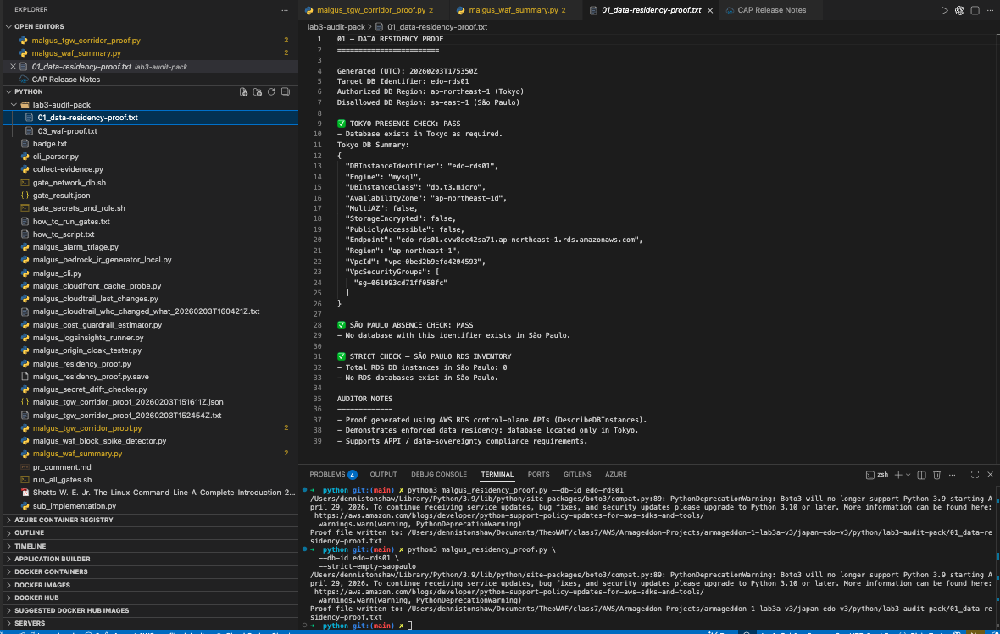

You will see a proof report written to:  
`malgus_db_residency_proof_YYYYMMDDTHHMMSSZ.txt`

List generated files:

```bash
ls malgus_db_residency_proof_*.txt
ls malgus_db_residency_proof_*.txt
```

sc<sup>64-9d</sup>

---

### Script 2 — malgus_tgw_corridor_proof.py

Shows TGW attachments and routes that form the “legal corridor”.

The script was updated to include:
- TGW route table route checks (remote CIDRs → peering attachment)  
- VPC route table route checks (remote CIDRs → TGW)  

Credentials:

```bash
aws sts get-caller-identity
```

Dependencies (if needed):

```bash
pip3 install boto3
```

Run corridor proof:

```bash
python3 malgus_tgw_corridor_proof.py \
--tokyo-remote-cidrs 10.81.0.0/16 \
--saopaulo-remote-cidrs 10.55.0.0/16
```

sc<sup>65-1</sup>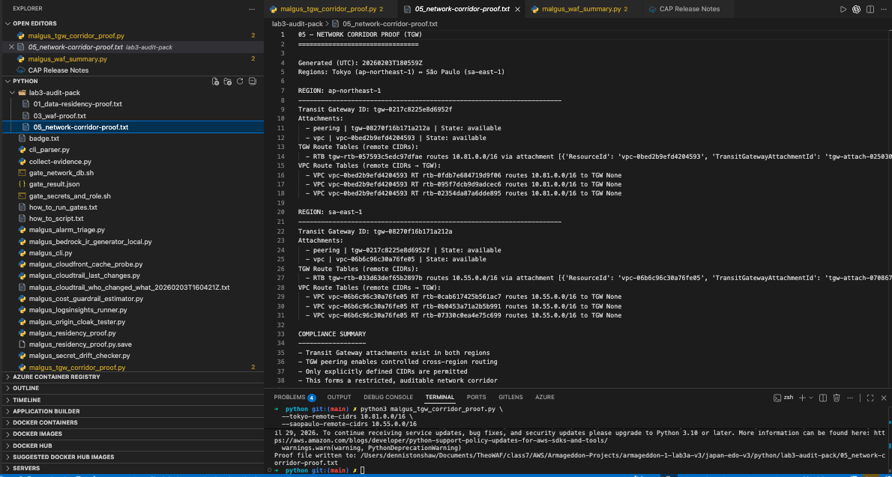

Expected result:
- Proof file written:  
  `malgus_tgw_corridor_proof_20260203T221512Z.txt`

```bash
cat lab3-audit-pack/05_network-corridor-proof.txt
```

sc<sup>65-2</sup>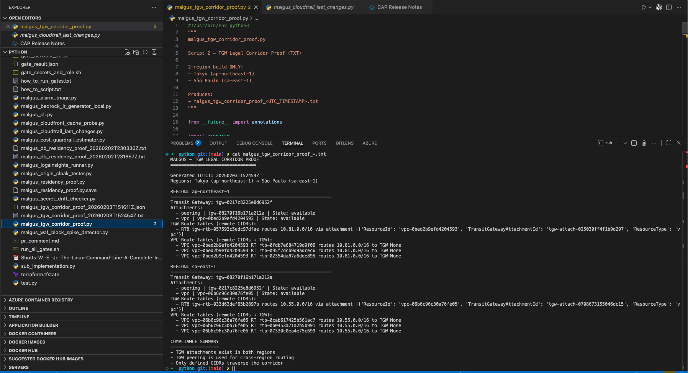

---

### Script 3 — malgus_cloudtrail_last_changes.py

Pulls recent CloudTrail events for “who changed what”.

Event history provides a 90-day record of management events.

Credentials:

```bash
aws sts get-caller-identity
```

Dependencies (if needed):

```bash
pip3 install boto3
```

Run for the last 7 days (Tokyo + São Paulo):

```bash
python3 malgus_cloudtrail_last_changes.py --days 7
```

sc<sup>66-1</sup>

Expected results:
- Proof file written

```bash
ls lab3-audit-pack/04_cloudtrail-change-proof.txt
```

```bash
cat lab3-audit-pack/04_cloudtrail-change-proof.txt
```

---

### Script 4 — malgus_waf_summary.py

Summarizes WAF logs (Allow vs Block) from CloudWatch Logs destination.

WAF logging destinations: CloudWatch Logs and S3.

Credentials:

```bash
aws sts get-caller-identity
```

Dependencies (if needed):

```bash
pip3 install boto3
```

Run summary (last 24 hours, default log group + Tokyo):

```bash
python3 malgus_waf_summary.py --hours 24
```

If WAF is attached to CloudFront (often us-east-1):

```bash
python3 malgus_waf_summary.py \
--region us-east-1 \
--log-group aws-waf-logs-edo-webacl01 \
--hours 24
```

View the proof:

```text
Expectede results 
Proof file written:
```

sc<sup>67-1</sup>

---

### Script 5 — malgus_cloudfront_log_explainer.py (optional)

NOT APPLICABLE

#### RATIONALE

CloudFront edge caching is not used in this deployment for the storage or processing of regulated data.

This system relies on regional Amazon S3 buckets for object storage, and CloudFront is not configured to cache or persist PHI at edge locations.

As a result, edge cache behavior evidence is not applicable to this architecture.

------

### evidence.jason

I created malgus_evidence_manifest.py in your python folder.

```bash
python3 malgus_evidence_manifest.py
```

Expected:
- evidence manifest written to: `lab3-audit-pack/evidence.json`

sc<sup>67-1</sup>

---
